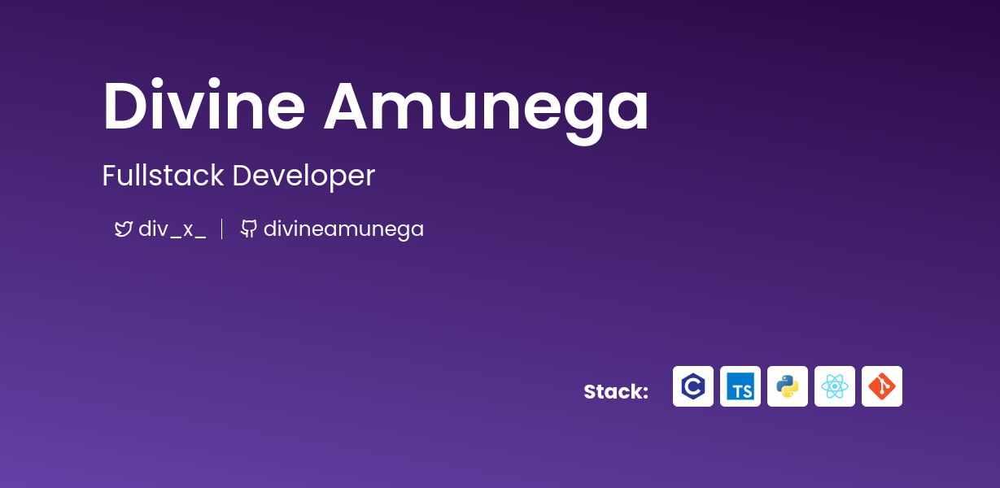

  

  

- 🔭 I’m currently working on [QuizzWhizz](https://quizwhiz-frontend.vercel.app/)

- 🌱 I’m currently learning **anything/everything about computers**

- 💬 Ask me about **javascript, python, C, computers**

- 📫 How to reach me **divineamunega@gmail.com**

- ⚡ Fun fact **I will go into web3 development soon**

<h3 align="left">Connect with me:</h3>

<h3 align="left">Languages and Tools:</h3>

       

