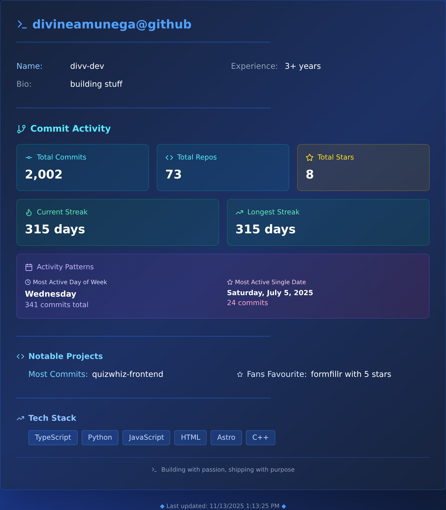

# GitHub Stats Dashboard



A beautiful, real-time GitHub stats dashboard built with Next.js, TypeScript, and Tailwind CSS.

*Auto-updated daily with the latest stats*

## Getting Started

First, install the dependencies:

```bash
pnpm install
```

Then, run the development server:

```bash
pnpm dev
```

Open [http://localhost:3000](http://localhost:3000) with your browser to see the result.

## Build for Production

```bash
pnpm build
pnpm start
```

## Tech Stack

- Next.js 15
- React 19
- TypeScript
- Tailwind CSS
- Lucide React (icons)
