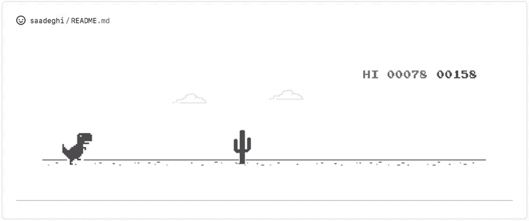

<h5> 
You Made It here Welcome 😊
 </h5>
 

I'm on an exciting tech journey. Starting in 2022, I've been learning web development and I'm currently diving into React. My journey began with HTML and CSS, then I faced JavaScript, which is quite the adventure. 

##### About Me

- :telescope: I'm currently learning ReactJS and NodeJS and building real world projects with them.

- :book: Reading God's General : The Healing Evangelists

- :zap: In my free time, I read my mails, play games, watch football,
  explore twitter, anything fun lol 😅.
- :tv: MCU 🍿🍿.. The Best 😊

Hello you.... again. It was nice meeting you. (I did not get to meet you) But anyways you can contact me below. 
 
This is also one of my best games😅😅 
Byeee for now.
 
 

